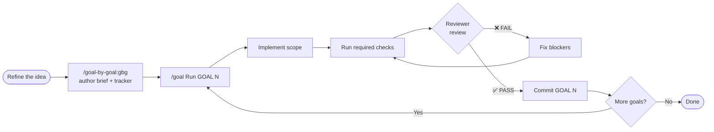

# goal-by-goal


> Turn any plan, PRD, or messy brief into a **sequenced, reviewer-gated execution document** — and let Claude run it one goal at a time, committing only after a second pair of eyes says PASS.

A [Claude Code](https://claude.com/claude-code) plugin. It ships a single skill, `gbg`, that converts a fuzzy plan into a disciplined milestone sequence where **every commit passes through an independent review gate** (Codex, Gemini, or a human senior) before it lands.

---

## Why

Any non-trivial development — **shipping a feature**, building an MVP, a migration, a refactor, a hardening pass — fails the same way: the agent races ahead, half-finishes three things at once, and you discover the breakage five commits later. `goal-by-goal` forces a different shape:

- **One goal at a time.** Each goal is independently shippable. The repo always builds.
- **Concrete acceptance criteria.** No "make it nice" — every goal states how you'll *know* it's done.
- **A review gate between commits.** A read-only reviewer (Codex/Gemini/human) checks each goal against its acceptance criteria. `FAIL` blocks the commit; `PASS` unblocks it.
- **A paper trail.** Brief, progress tracker, and one saved review per goal — so "did we actually do it correctly?" has an answer on disk.

Use it for the everyday feature you want to land cleanly, not just the multi-week migration. The pattern is proven on a 9-goal mobile platform-parity migration (Codex reviewer, visible "Round 1 FAIL → Round 2 PASS" history) — and the same gate works just as well on a single feature broken into a handful of shippable steps.

---

## The full loop



1. **Refine the idea** → a plan, PRD, GitHub issue, or solid conversation summary. Not perfect — GOAL 0 captures the baseline — but the intent and scope should be clear.
2. **`/goal-by-goal:gbg`** → it interviews you, decomposes the work into 5–12 reviewable goals, and writes the brief, tracker, and reviews directory.
3. **`/goal Run GOAL N`** → the runner builds, checks, reviews, fixes, and commits on PASS. Then advance to the next goal. One at a time.

---

## Install

In Claude Code:

```text
/plugin marketplace add cielebak/goal-by-goal
/plugin install goal-by-goal@goal-by-goal
```

Then restart or reload, and the skill is available. Invoke it with:

```text
/goal-by-goal:gbg
```

…or just describe the intent ("break this PRD into reviewable milestones", "convert plan to goals", "codex-gated execution") and Claude will reach for it.

> **Uninstall / update:** `/plugin uninstall goal-by-goal@goal-by-goal`, or `/plugin marketplace update goal-by-goal` to pull the latest.

---

## How it works

When you run the skill, it walks through seven steps:

1. **Locate the source plan** — a file path, a GitHub issue, or this conversation.
2. **Gather parameters** — scope name, reviewer, required check commands, locked decisions, current state, language, target goal count.
3. **Draft the goal sequence** — 5–12 goals, foundation-first, each shippable.
4. **Quiz you on the breakdown** — granularity, ordering, splits/merges — iterate until approved.
5. **Generate the artifacts** (see below).
6. **Generate the reviewer prompt** — a fixed-format contract tuned to your stack.
7. **Print the kickoff snippet** — how to run GOAL 0, and the commit convention.

### What it generates

```
<SCOPE>_BRIEF_<YYYY-MM-DD>.md      # full brief: locked decisions, workflow, every goal
docs/<scope>/agent-progress.md      # tracker table, one row per goal, status column
docs/<scope>/reviews/.gitkeep       # where each goal-XX-<reviewer>.md verdict lands
# (optional) a CLAUDE.md workflow section
```

### The review gate

Each goal ends with a single non-negotiable acceptance bullet: **`Reviewer review PASS`**. The reviewer runs read-only and returns a short, scannable Markdown review — verdict first, fixes inline, empty sections dropped:

```markdown
## Review — Goal N: <title>

**Verdict: ✅ PASS** — <one-line reason>

### 🔴 Blockers
1. **<title>** — <what breaks> · `file:line`
   ↳ Fix: <concrete action>

### 🟡 Should fix
- **<title>** — <why> · `file:line`

---
*Checked:* `<commands run>` · <N files>
```

A clean PASS is just the verdict line and the `Checked:` footer; `FAIL` means at least one 🔴 Blocker.

Commit format is enforced too:

```text
feat(<scope>-goal-N): <summary>
fix(<scope>-goal-N): <summary after a review fix>
```

### Example: a real Codex review

A feature goal — *coupon codes at checkout* — comes back from Codex like this. The
gate caught a bug before it shipped, so the commit is blocked until it's fixed:

```markdown
## Review — Goal 3: Coupon codes at checkout

**Verdict: ❌ FAIL** — discount is applied after tax, so totals are wrong in taxed regions.

### 🔴 Blockers
1. **Discount applied to gross, not net** — coupon is subtracted after `calcTax()`, inflating the refund. · `src/checkout/total.ts:84`
   ↳ Fix: subtract the discount from the subtotal *before* tax, then tax the net.
2. **Expired coupons still accepted** — `validUntil` is parsed but never compared to now. · `src/coupons/validate.ts:31`
   ↳ Fix: reject when `Date.now() > validUntil`; add a boundary test.

### 🟡 Should fix
- **No cap on stacked coupons** — two 50% codes zero the order. · `src/checkout/apply.ts:47`

### ⚪ Nits
- Codes compared case-sensitively; users type `save10` and `SAVE10`. · `src/coupons/validate.ts:12`

---
*Checked:* `npm run build · npm test -- checkout` · 6 files
```

Round 2, after the fixes, is a one-liner — `**Verdict: ✅ PASS**` — and the commit lands.

---

## Pairs well with `/goal` and auto mode

`goal-by-goal` *authors* the plan; you *execute* it one goal at a time.

### With `/goal`

If you have a goal-runner command (e.g. `/goal`), the kickoff looks like:

```text
/goal Run GOAL 0 only from <SCOPE>_BRIEF_<DATE>.md. Do not continue to GOAL 1.
```

`/goal` sets a session goal and keeps Claude working toward it — it won't stop
until the goal's condition holds. Because each goal in the brief carries
concrete acceptance criteria *and* ends in `Reviewer review PASS`, the goal
runner has an unambiguous, verifiable stop condition for every milestone.
After the reviewer returns PASS and you commit, advance to the next goal.

### With Claude Code auto mode

The brief is built to be run hands-off in **Claude Code auto mode** (execute
without per-step approval). The review gate is exactly what makes that safe:
auto mode supplies the speed, the reviewer (Codex / Gemini / human) supplies
the brakes. Claude implements a goal, runs the required checks, requests the
read-only review, fixes any `BLOCKERS`, and **only commits on `PASS`** — so an
autonomous run still can't land unreviewed code. Locked decisions in the brief
keep auto mode from re-litigating settled scope mid-run.

Sequential by design — no parallel goals, no forward references.

---

## When to use it

**Good fit**
- **Building a feature** that splits into a few independently shippable steps
- Greenfield MVPs that decompose into 5–12 milestones
- Migrations (platform parity, framework upgrades, stack swaps)
- Large refactors with clear surface area
- Security hardening / compliance work
- Anything where "did we actually do it correctly?" deserves a second pair of eyes before each commit

**Skip it for**
- One-shot bugfixes
- Exploratory spikes without success criteria
- Trivial single-file changes

---

## Repository layout

```
.claude-plugin/
  marketplace.json        # marketplace catalog (one plugin)
  plugin.json             # plugin manifest
skills/
  gbg/
    SKILL.md              # the skill
    templates/            # brief, tracker, reviewer-prompt, CLAUDE.md addition
assets/
  screenshot.jpg          # hero image
README.md
LICENSE
```

---

## License

MIT © cielebak. See [LICENSE](./LICENSE).
